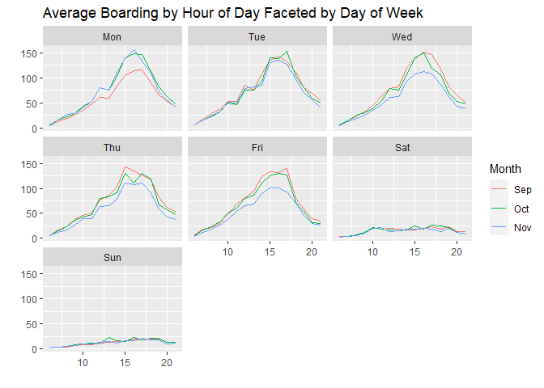
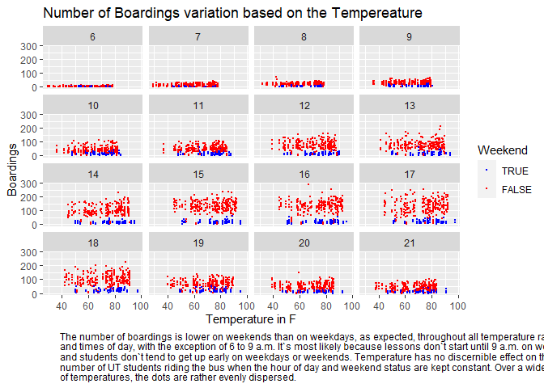
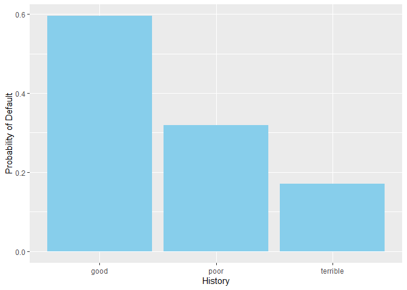
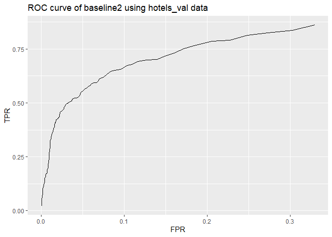

## Question 1. Data Visualization

### On weekdays, the average number of boardings is roughly the same, and on weekends, it drops as expected. On weekdays, the peak hour of boarding numbers remains consistent between 3 and 5 pm for all three months, owing to the fact that classes normally complete around that time. The average boardings on Mondays in September are lower due to Labor Day, which falls on the first Monday of the month, and those on Wednesdays, Thursdays, and Fridays in November due to the Thanksgiving holidays).

### The number of boardings is lower on weekends than on weekdays, as expected, throughout all temperature ranges and times of day, with the exception of 6 to 9 a.m. It’s most likely because lessons don’t start until 9 a.m. on weekdays, and students don’t tend to get up early on weekdays or weekends. Temperature has no discernible effect on the number of UT students riding the bus when the hour of day and weekend status are kept constant. Over a wide range of temperatures, the dots are rather evenly dispersed.

## Question 2. Saratoga house prices

### The linear model appears to have a better out-of-sample mean-squared error. This model is especially useful since it enables us to determine which variables have a significant impact on property values. Lot size, property value, living area, waterfront, and central air conditioning are all elements that influence house pricing. They all have a favorable correlation with housing prices.

### Output for linear regression model is as follows:

    ## 
    ## Call:
    ## lm(formula = price ~ . - pctCollege - sewer - newConstruction + 
    ##     rooms:bathrooms, data = .)
    ## 
    ## Residuals:
    ##     Min      1Q  Median      3Q     Max 
    ## -225936  -35206   -5168   28230  459848 
    ## 
    ## Coefficients:
    ##                          Estimate Std. Error t value Pr(>|t|)    
    ## (Intercept)             1.935e+05  2.217e+04   8.726  < 2e-16 ***
    ## lotSize                 1.011e+04  2.372e+03   4.263 2.14e-05 ***
    ## age                    -6.664e+01  6.026e+01  -1.106 0.269004    
    ## landValue               8.556e-01  4.813e-02  17.778  < 2e-16 ***
    ## livingArea              6.477e+01  4.960e+00  13.059  < 2e-16 ***
    ## bedrooms               -7.028e+03  2.701e+03  -2.602 0.009351 ** 
    ## fireplaces              3.146e+03  3.123e+03   1.007 0.313913    
    ## bathrooms               5.870e+03  7.864e+03   0.746 0.455520    
    ## rooms                  -1.689e+03  2.145e+03  -0.787 0.431172    
    ## heatinghot water/steam -7.486e+03  4.383e+03  -1.708 0.087866 .  
    ## heatingelectric         2.880e+03  1.291e+04   0.223 0.823526    
    ## fuelelectric           -1.401e+04  1.274e+04  -1.099 0.271801    
    ## fueloil                -6.805e+03  5.035e+03  -1.352 0.176730    
    ## waterfrontNo           -1.267e+05  1.552e+04  -8.162 6.79e-16 ***
    ## centralAirNo           -1.300e+04  3.617e+03  -3.593 0.000337 ***
    ## bathrooms:rooms         2.202e+03  9.800e+02   2.247 0.024786 *  
    ## ---
    ## Signif. codes:  0 '***' 0.001 '**' 0.01 '*' 0.05 '.' 0.1 ' ' 1
    ## 
    ## Residual standard error: 58460 on 1539 degrees of freedom
    ## Multiple R-squared:  0.6539, Adjusted R-squared:  0.6505 
    ## F-statistic: 193.9 on 15 and 1539 DF,  p-value: < 2.2e-16

## Question 3. Classification and retrospective sampling

    ##         (Intercept)            duration              amount         installment 
    ##                0.41                1.03                1.00                1.33 
    ##                 age         historypoor     historyterrible          purposeedu 
    ##                0.98                0.35                0.14                2.12 
    ## purposegoods/repair       purposenewcar      purposeusedcar       foreigngerman 
    ##                1.19                2.66                0.44                0.14

    ##    yhat
    ## y     0   1
    ##   0 160  26
    ##   1  45  19

<table>
<thead>
<tr class="header">
<th style="text-align: left;">history</th>
<th style="text-align: right;">count</th>
</tr>
</thead>
<tbody>
<tr class="odd">
<td style="text-align: left;">good</td>
<td style="text-align: right;">89</td>
</tr>
<tr class="even">
<td style="text-align: left;">poor</td>
<td style="text-align: right;">618</td>
</tr>
<tr class="odd">
<td style="text-align: left;">terrible</td>
<td style="text-align: right;">293</td>
</tr>
<tr class="even">
<td style="text-align: left;">total</td>
<td style="text-align: right;">1000</td>
</tr>
</tbody>
</table>

#### The `historypoor` variable multiplies odds of default by 0.39 in this logistic regression model, while the `historyterrible` variable multiplies odds of default by 0.19. This means that having poor or terrible credit actually decreases the probability of default. This contradicts common sense; we believe the dataset is insufficient for developing a predictive model of defaults, particularly if the program’s goal is to screen potential borrowers and identify them as having a “high” or “low” risk of default. It’s due to the data sampling procedure. Instead of random sample, the bank chose defaulted loans and looked for similar loans during the data sampling procedure. This most certainly resulted in a significant bias in the data collection process: as previously stated, defaulted loans are likely to have low or horrible credit histories, and there would be insufficient datasets with good credit histories. In fact, just 89 observations out of 1000 had a decent credit history. Even though there would be a small number of defaulted loans, I would advise the bank to employ a random sample method. Increasing the size of the observations, if possible, will be really beneficial.

## Question 4. Children and hotel reservations

<table>
<thead>
<tr class="header">
<th style="text-align: left;">model</th>
<th style="text-align: right;">TPR</th>
<th style="text-align: right;">FPR</th>
<th style="text-align: right;">thresh</th>
</tr>
</thead>
<tbody>
<tr class="odd">
<td style="text-align: left;">baseline1</td>
<td style="text-align: right;">0.0000000</td>
<td style="text-align: right;">0.0000000</td>
<td style="text-align: right;">0.7</td>
</tr>
<tr class="even">
<td style="text-align: left;">baseline2</td>
<td style="text-align: right;">0.0453920</td>
<td style="text-align: right;">0.0014505</td>
<td style="text-align: right;">0.7</td>
</tr>
<tr class="odd">
<td style="text-align: left;">LPM</td>
<td style="text-align: right;">0.0277854</td>
<td style="text-align: right;">0.0009912</td>
<td style="text-align: right;">0.7</td>
</tr>
<tr class="even">
<td style="text-align: left;">baseline1</td>
<td style="text-align: right;">0.0000000</td>
<td style="text-align: right;">0.0000000</td>
<td style="text-align: right;">0.5</td>
</tr>
<tr class="odd">
<td style="text-align: left;">baseline2</td>
<td style="text-align: right;">0.0803301</td>
<td style="text-align: right;">0.0032636</td>
<td style="text-align: right;">0.5</td>
</tr>
<tr class="even">
<td style="text-align: left;">LPM</td>
<td style="text-align: right;">0.0797799</td>
<td style="text-align: right;">0.0036988</td>
<td style="text-align: right;">0.5</td>
</tr>
<tr class="odd">
<td style="text-align: left;">baseline1</td>
<td style="text-align: right;">0.0000000</td>
<td style="text-align: right;">0.0000000</td>
<td style="text-align: right;">0.2</td>
</tr>
<tr class="even">
<td style="text-align: left;">baseline2</td>
<td style="text-align: right;">0.1224209</td>
<td style="text-align: right;">0.0118699</td>
<td style="text-align: right;">0.2</td>
</tr>
<tr class="odd">
<td style="text-align: left;">LPM</td>
<td style="text-align: right;">0.1185695</td>
<td style="text-align: right;">0.0127886</td>
<td style="text-align: right;">0.2</td>
</tr>
</tbody>
</table>

### This table has the TPR and FPR of the models when the threshold is set at 0.7, 0.5, and 0.2. Across various threshold values, baseline 1 displays low TPRs. We can see that the baseline 2 and LPM has higher TPRs. We choose baseline2 for further analysis.

### Step 1 for Model validation

### Step 2 for Model validation

<table>
<thead>
<tr class="header">
<th style="text-align: left;"></th>
<th style="text-align: left;">Predicted</th>
<th style="text-align: left;">Actual</th>
<th style="text-align: left;">Difference</th>
</tr>
</thead>
<tbody>
<tr class="odd">
<td style="text-align: left;">Fold01</td>
<td style="text-align: left;">20</td>
<td style="text-align: left;">20</td>
<td style="text-align: left;">0</td>
</tr>
<tr class="even">
<td style="text-align: left;">Fold02</td>
<td style="text-align: left;">22</td>
<td style="text-align: left;">25</td>
<td style="text-align: left;">3</td>
</tr>
<tr class="odd">
<td style="text-align: left;">Fold03</td>
<td style="text-align: left;">19</td>
<td style="text-align: left;">23</td>
<td style="text-align: left;">4</td>
</tr>
<tr class="even">
<td style="text-align: left;">Fold04</td>
<td style="text-align: left;">23</td>
<td style="text-align: left;">28</td>
<td style="text-align: left;">5</td>
</tr>
<tr class="odd">
<td style="text-align: left;">Fold05</td>
<td style="text-align: left;">22</td>
<td style="text-align: left;">22</td>
<td style="text-align: left;">0</td>
</tr>
<tr class="even">
<td style="text-align: left;">Fold06</td>
<td style="text-align: left;">19</td>
<td style="text-align: left;">28</td>
<td style="text-align: left;">9</td>
</tr>
<tr class="odd">
<td style="text-align: left;">Fold07</td>
<td style="text-align: left;">22</td>
<td style="text-align: left;">22</td>
<td style="text-align: left;">0</td>
</tr>
<tr class="even">
<td style="text-align: left;">Fold08</td>
<td style="text-align: left;">18</td>
<td style="text-align: left;">14</td>
<td style="text-align: left;">-4</td>
</tr>
<tr class="odd">
<td style="text-align: left;">Fold09</td>
<td style="text-align: left;">23</td>
<td style="text-align: left;">21</td>
<td style="text-align: left;">-2</td>
</tr>
<tr class="even">
<td style="text-align: left;">Fold10</td>
<td style="text-align: left;">23</td>
<td style="text-align: left;">14</td>
<td style="text-align: left;">-9</td>
</tr>
<tr class="odd">
<td style="text-align: left;">Fold11</td>
<td style="text-align: left;">22</td>
<td style="text-align: left;">16</td>
<td style="text-align: left;">-6</td>
</tr>
<tr class="even">
<td style="text-align: left;">Fold12</td>
<td style="text-align: left;">20</td>
<td style="text-align: left;">14</td>
<td style="text-align: left;">-6</td>
</tr>
<tr class="odd">
<td style="text-align: left;">Fold13</td>
<td style="text-align: left;">19</td>
<td style="text-align: left;">18</td>
<td style="text-align: left;">-1</td>
</tr>
<tr class="even">
<td style="text-align: left;">Fold14</td>
<td style="text-align: left;">22</td>
<td style="text-align: left;">23</td>
<td style="text-align: left;">1</td>
</tr>
<tr class="odd">
<td style="text-align: left;">Fold15</td>
<td style="text-align: left;">22</td>
<td style="text-align: left;">18</td>
<td style="text-align: left;">-4</td>
</tr>
<tr class="even">
<td style="text-align: left;">Fold16</td>
<td style="text-align: left;">23</td>
<td style="text-align: left;">16</td>
<td style="text-align: left;">-7</td>
</tr>
<tr class="odd">
<td style="text-align: left;">Fold17</td>
<td style="text-align: left;">19</td>
<td style="text-align: left;">21</td>
<td style="text-align: left;">2</td>
</tr>
<tr class="even">
<td style="text-align: left;">Fold18</td>
<td style="text-align: left;">20</td>
<td style="text-align: left;">17</td>
<td style="text-align: left;">-3</td>
</tr>
<tr class="odd">
<td style="text-align: left;">Fold19</td>
<td style="text-align: left;">23</td>
<td style="text-align: left;">21</td>
<td style="text-align: left;">-2</td>
</tr>
<tr class="even">
<td style="text-align: left;">Fold20</td>
<td style="text-align: left;">18</td>
<td style="text-align: left;">21</td>
<td style="text-align: left;">3</td>
</tr>
<tr class="odd">
<td style="text-align: left;">Total</td>
<td style="text-align: left;">419</td>
<td style="text-align: left;">402</td>
<td style="text-align: left;">17</td>
</tr>
</tbody>
</table>

### The model does the prediction pretty well. It only got 17 predictions wrong in total out of 4999 observations though if you look at each folds individually there is a difference as in sometimes we have negative and sometimes positive values, but in total it all averages out to 17.
