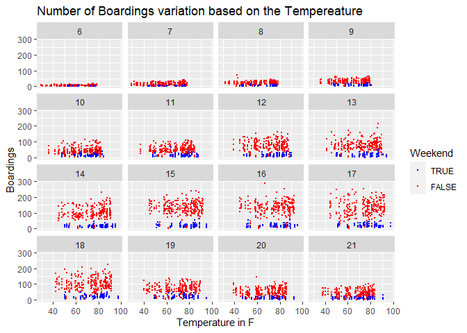

## Question 1. Data Visualization

### On weekdays, the average number of boardings is roughly the same, and on weekends, it drops as expected. On weekdays, the peak hour of boarding numbers remains consistent between 3 and 5 pm for all three months, owing to the fact that classes normally complete around that time. The average boardings on Mondays in September are lower due to Labor Day, which falls on the first Monday of the month, and those on Wednesdays, Thursdays, and Fridays in November due to the Thanksgiving holidays)

## Question 2. Saratoga house prices

### The linear model seems better at achieving lower out-of sample mean-squared error. This model is particularly useful since it allows us to identify which variables have a substantial impact on property prices. House prices are influenced by factors such as lot size, land value, living area, waterfront, and central air conditioning. All of them have a positive relationship with home prices.

### Output for linear regression model is as follows:

    ## 
    ## Call:
    ## lm(formula = price ~ . - pctCollege - sewer - newConstruction + 
    ##     rooms:bathrooms, data = .)
    ## 
    ## Residuals:
    ##     Min      1Q  Median      3Q     Max 
    ## -220402  -34540   -5128   27705  461251 
    ## 
    ## Coefficients:
    ##                          Estimate Std. Error t value Pr(>|t|)    
    ## (Intercept)             1.847e+05  2.306e+04   8.010 2.25e-15 ***
    ## lotSize                 1.012e+04  2.368e+03   4.273 2.05e-05 ***
    ## age                    -7.807e+01  5.974e+01  -1.307  0.19152    
    ## landValue               8.539e-01  4.917e-02  17.367  < 2e-16 ***
    ## livingArea              6.782e+01  4.896e+00  13.853  < 2e-16 ***
    ## bedrooms               -8.189e+03  2.721e+03  -3.009  0.00266 ** 
    ## fireplaces              2.347e+03  3.067e+03   0.765  0.44426    
    ## bathrooms               3.299e+03  7.854e+03   0.420  0.67449    
    ## rooms                  -1.592e+03  2.134e+03  -0.746  0.45567    
    ## heatinghot water/steam -8.792e+03  4.350e+03  -2.021  0.04345 *  
    ## heatingelectric        -1.445e+03  1.254e+04  -0.115  0.90825    
    ## fuelelectric           -7.236e+03  1.232e+04  -0.587  0.55702    
    ## fueloil                -3.536e+03  4.961e+03  -0.713  0.47612    
    ## waterfrontNo           -1.204e+05  1.716e+04  -7.017 3.40e-12 ***
    ## centralAirNo           -9.728e+03  3.588e+03  -2.711  0.00678 ** 
    ## bathrooms:rooms         2.410e+03  9.851e+02   2.446  0.01455 *  
    ## ---
    ## Signif. codes:  0 '***' 0.001 '**' 0.01 '*' 0.05 '.' 0.1 ' ' 1
    ## 
    ## Residual standard error: 57800 on 1539 degrees of freedom
    ## Multiple R-squared:  0.6547, Adjusted R-squared:  0.6513 
    ## F-statistic: 194.5 on 15 and 1539 DF,  p-value: < 2.2e-16

## Question 3. Classification and retrospective sampling

    ##         (Intercept)            duration              amount         installment 
    ##                0.44                1.03                1.00                1.29 
    ##                 age         historypoor     historyterrible          purposeedu 
    ##                0.98                0.27                0.12                1.32 
    ## purposegoods/repair       purposenewcar      purposeusedcar       foreigngerman 
    ##                1.16                2.44                0.58                0.37

    ##    yhat
    ## y     0   1
    ##   0 161  15
    ##   1  60  14

<table>
<thead>
<tr class="header">
<th style="text-align: left;">history</th>
<th style="text-align: right;">count</th>
</tr>
</thead>
<tbody>
<tr class="odd">
<td style="text-align: left;">good</td>
<td style="text-align: right;">89</td>
</tr>
<tr class="even">
<td style="text-align: left;">poor</td>
<td style="text-align: right;">618</td>
</tr>
<tr class="odd">
<td style="text-align: left;">terrible</td>
<td style="text-align: right;">293</td>
</tr>
<tr class="even">
<td style="text-align: left;">total</td>
<td style="text-align: right;">1000</td>
</tr>
</tbody>
</table>

#### The `historypoor` variable multiplies odds of default by 0.39 in this logistic regression model, while the `historyterrible` variable multiplies odds of default by 0.19. This means that having poor or terrible credit actually decreases the probability of default. This contradicts common sense; we believe the dataset is insufficient for developing a predictive model of defaults, particularly if the program’s goal is to screen potential borrowers and identify them as having a “high” or “low” risk of default. It’s due to the data sampling procedure. Instead of random sample, the bank chose defaulted loans and looked for similar loans during the data sampling procedure. This most certainly resulted in a significant bias in the data collection process: as previously stated, defaulted loans are likely to have low or horrible credit histories, and there would be insufficient datasets with good credit histories. In fact, just 89 observations out of 1000 had a decent credit history. Even though there would be a small number of defaulted loans, I would advise the bank to employ a random sample method. Increasing the size of the observations, if possible, will be really beneficial.

## Question 4. Children and hotel reservations

<table>
<thead>
<tr class="header">
<th style="text-align: left;">model</th>
<th style="text-align: right;">TPR</th>
<th style="text-align: right;">FPR</th>
<th style="text-align: right;">thresh</th>
</tr>
</thead>
<tbody>
<tr class="odd">
<td style="text-align: left;">baseline1</td>
<td style="text-align: right;">0.0000000</td>
<td style="text-align: right;">0.0000000</td>
<td style="text-align: right;">0.7</td>
</tr>
<tr class="even">
<td style="text-align: left;">baseline2</td>
<td style="text-align: right;">0.0558459</td>
<td style="text-align: right;">0.0016681</td>
<td style="text-align: right;">0.7</td>
</tr>
<tr class="odd">
<td style="text-align: left;">LPM</td>
<td style="text-align: right;">0.0283356</td>
<td style="text-align: right;">0.0008945</td>
<td style="text-align: right;">0.7</td>
</tr>
<tr class="even">
<td style="text-align: left;">baseline1</td>
<td style="text-align: right;">0.0000000</td>
<td style="text-align: right;">0.0000000</td>
<td style="text-align: right;">0.5</td>
</tr>
<tr class="odd">
<td style="text-align: left;">baseline2</td>
<td style="text-align: right;">0.0921596</td>
<td style="text-align: right;">0.0029252</td>
<td style="text-align: right;">0.5</td>
</tr>
<tr class="even">
<td style="text-align: left;">LPM</td>
<td style="text-align: right;">0.0902338</td>
<td style="text-align: right;">0.0034329</td>
<td style="text-align: right;">0.5</td>
</tr>
<tr class="odd">
<td style="text-align: left;">baseline1</td>
<td style="text-align: right;">0.0002751</td>
<td style="text-align: right;">0.0000000</td>
<td style="text-align: right;">0.2</td>
</tr>
<tr class="even">
<td style="text-align: left;">baseline2</td>
<td style="text-align: right;">0.1389271</td>
<td style="text-align: right;">0.0109755</td>
<td style="text-align: right;">0.2</td>
</tr>
<tr class="odd">
<td style="text-align: left;">LPM</td>
<td style="text-align: right;">0.1345254</td>
<td style="text-align: right;">0.0122567</td>
<td style="text-align: right;">0.2</td>
</tr>
</tbody>
</table>

### This table has the TPR and FPR of the models when the threshold is set at 0.7, 0.5, and 0.2. Across various threshold values, baseline 1 displays low TPRs. We can see that the baseline 2 and LPM has higher TPRs. We choose baseline2 for further analysis.

### Step 1 for Model validation

### Step 2 for Model validation

<table>
<thead>
<tr class="header">
<th style="text-align: left;"></th>
<th style="text-align: left;">Predicted</th>
<th style="text-align: left;">Actual</th>
<th style="text-align: left;">Difference</th>
</tr>
</thead>
<tbody>
<tr class="odd">
<td style="text-align: left;">Fold01</td>
<td style="text-align: left;">19</td>
<td style="text-align: left;">19</td>
<td style="text-align: left;">0</td>
</tr>
<tr class="even">
<td style="text-align: left;">Fold02</td>
<td style="text-align: left;">22</td>
<td style="text-align: left;">21</td>
<td style="text-align: left;">-1</td>
</tr>
<tr class="odd">
<td style="text-align: left;">Fold03</td>
<td style="text-align: left;">22</td>
<td style="text-align: left;">20</td>
<td style="text-align: left;">-2</td>
</tr>
<tr class="even">
<td style="text-align: left;">Fold04</td>
<td style="text-align: left;">18</td>
<td style="text-align: left;">24</td>
<td style="text-align: left;">6</td>
</tr>
<tr class="odd">
<td style="text-align: left;">Fold05</td>
<td style="text-align: left;">22</td>
<td style="text-align: left;">20</td>
<td style="text-align: left;">-2</td>
</tr>
<tr class="even">
<td style="text-align: left;">Fold06</td>
<td style="text-align: left;">18</td>
<td style="text-align: left;">21</td>
<td style="text-align: left;">3</td>
</tr>
<tr class="odd">
<td style="text-align: left;">Fold07</td>
<td style="text-align: left;">22</td>
<td style="text-align: left;">21</td>
<td style="text-align: left;">-1</td>
</tr>
<tr class="even">
<td style="text-align: left;">Fold08</td>
<td style="text-align: left;">18</td>
<td style="text-align: left;">19</td>
<td style="text-align: left;">1</td>
</tr>
<tr class="odd">
<td style="text-align: left;">Fold09</td>
<td style="text-align: left;">18</td>
<td style="text-align: left;">16</td>
<td style="text-align: left;">-2</td>
</tr>
<tr class="even">
<td style="text-align: left;">Fold10</td>
<td style="text-align: left;">20</td>
<td style="text-align: left;">19</td>
<td style="text-align: left;">-1</td>
</tr>
<tr class="odd">
<td style="text-align: left;">Fold11</td>
<td style="text-align: left;">23</td>
<td style="text-align: left;">20</td>
<td style="text-align: left;">-3</td>
</tr>
<tr class="even">
<td style="text-align: left;">Fold12</td>
<td style="text-align: left;">23</td>
<td style="text-align: left;">28</td>
<td style="text-align: left;">5</td>
</tr>
<tr class="odd">
<td style="text-align: left;">Fold13</td>
<td style="text-align: left;">22</td>
<td style="text-align: left;">20</td>
<td style="text-align: left;">-2</td>
</tr>
<tr class="even">
<td style="text-align: left;">Fold14</td>
<td style="text-align: left;">22</td>
<td style="text-align: left;">22</td>
<td style="text-align: left;">0</td>
</tr>
<tr class="odd">
<td style="text-align: left;">Fold15</td>
<td style="text-align: left;">18</td>
<td style="text-align: left;">18</td>
<td style="text-align: left;">0</td>
</tr>
<tr class="even">
<td style="text-align: left;">Fold16</td>
<td style="text-align: left;">18</td>
<td style="text-align: left;">11</td>
<td style="text-align: left;">-7</td>
</tr>
<tr class="odd">
<td style="text-align: left;">Fold17</td>
<td style="text-align: left;">18</td>
<td style="text-align: left;">17</td>
<td style="text-align: left;">-1</td>
</tr>
<tr class="even">
<td style="text-align: left;">Fold18</td>
<td style="text-align: left;">19</td>
<td style="text-align: left;">24</td>
<td style="text-align: left;">5</td>
</tr>
<tr class="odd">
<td style="text-align: left;">Fold19</td>
<td style="text-align: left;">22</td>
<td style="text-align: left;">20</td>
<td style="text-align: left;">-2</td>
</tr>
<tr class="even">
<td style="text-align: left;">Fold20</td>
<td style="text-align: left;">24</td>
<td style="text-align: left;">22</td>
<td style="text-align: left;">-2</td>
</tr>
<tr class="odd">
<td style="text-align: left;">Total</td>
<td style="text-align: left;">408</td>
<td style="text-align: left;">402</td>
<td style="text-align: left;">6</td>
</tr>
</tbody>
</table>

### The model does the prediction pretty well. It only got 6 predictions wrong in total out of 4999 observations though if you look at each folds individually there is a difference as in sometimes we have negative and sometimes positive values, but in total it all averages out to 6.
